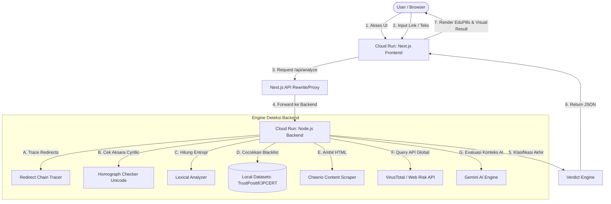

# 🛡️ Abjad.in — Baca Dulu, Baru Klik.
> **Platform Deteksi Dini Ancaman Tautan & Pesan Digital Pintar Berbasis Cloud AI & Threat Intelligence Terintegrasi.**  
> *Dikembangkan khusus untuk Google Cloud Platform (GCP) #JuaraVibeCoding*

[](https://nextjs.org)
[](https://nodejs.org)
[](https://cloud.google.com/run)
[](https://deepmind.google/technologies/gemini/)

---

## 🌐 Tautan Demo Live
* **Aplikasi Web (Frontend):** [https://abjadin-frontend-79780817932.asia-southeast2.run.app/](https://abjadin-frontend-79780817932.asia-southeast2.run.app/)
* **API Health Check (Backend):** [https://abjadin-backend-79780817932.asia-southeast2.run.app/health](https://abjadin-backend-79780817932.asia-southeast2.run.app/health)

---

## ✨ Fitur & Keunggulan Utama

Abjad.in bukan sekadar pemindai link biasa. Kami mengintegrasikan pendekatan keamanan berlapis (Defense-in-Depth) untuk melindungi pengguna awam dari ancaman kejahatan siber:

1. **🕵️ Homograph Attack Detector (Punycode Decoder)**  
   Membongkar penipuan domain tiruan menggunakan karakter aksara mirip (misalnya huruf `е` Cyrillic pada domain palsu `shopеe.com`).
2. **🧠 Gemini Smart AI Override (Anti False-Positive)**  
   Menggunakan kecerdasan buatan Gemini secara dinamis untuk mengidentifikasi dan memvalidasi keaslian sebuah brand/institusi resmi secara kontekstual guna meminimalkan kesalahan deteksi (*false positive*).
3. **📊 Rantai Pengalihan Transparan (Redirect Chain Tracer)**  
   Melacak rute link pendek (seperti bit.ly/...) hingga bermuara ke URL tujuan akhir yang sebenarnya.
4. **🔍 Analisis Konten Web Ringan (Lightweight Content Scraping)**  
   Mendeteksi jebakan form login tiruan, permintaan kode PIN/OTP yang tidak sah, countdown palsu untuk memicu kepanikan, ketidakcocokan favicon, serta tautan unduhan otomatis (.apk/.exe) tanpa menggunakan browser headless yang berat.
5. **🗃️ Database Reputasi Terpadu (Multi-Source Threat Intel)**  
   Mengintegrasikan hasil dari **Google Web Risk API**, **VirusTotal**, **PhishTank**, dan database lokal **Internet Positif (TrustPositif)** serta **JPCERT/CC**.
6. **💊 EduPills (Edukasi Keamanan Digital)**  
   Menyajikan hasil analisis dalam bahasa yang mudah dipahami oleh pengguna awam lengkap dengan tips proteksi dini sesuai ancaman spesifik yang terdeteksi.

---

## 🏗️ Arsitektur Sistem

Aplikasi ini dibangun menggunakan arsitektur microservices serverless yang dideploy di Google Cloud Run dengan alur pengolahan data sebagai berikut:



---

## 🛠️ Arsitektur Teknologi (Tech Stack)

### **Frontend (Next.js)**
* **Framework:** Next.js 15 (App Router, TypeScript)
* **Styling:** Vanilla CSS & TailwindCSS (Desain Modern, Responsif, Glassmorphism, Micro-Animations)
* **Deployment:** Dockerized standalone output on Google Cloud Run

### **Backend (Node.js)**
* **Framework:** Express.js (Node.js)
* **Web Scraping:** Cheerio & Axios (Ultra-fast parser)
* **Deteksi Homograph:** Punycode decoder & Unicode Property Escapes Regex
* **Rate Limiting:** Express-rate-limit dengan bypass validasi proxy khusus lingkungan serverless Cloud Run.

### **Infrastruktur Google Cloud Platform (GCP)**
* **Google Cloud Run:** Menjalankan microservices frontend dan backend secara otomatis (*autoscaling dari 0 ke 3 instance*).
* **Google Artifact Registry:** Penyimpanan repositori image Docker container yang aman.
* **Google Cloud Build:** Integrasi CI/CD otomatis. Setiap dorongan kode (`git push`) ke branch `main` pada repositori GitHub akan memicu build baru dan deploy otomatis ke Cloud Run.
* **Google Web Risk API & Gemini API:** Penyedia data reputasi ancaman global dan otak kecerdasan analisis siber.

---

## 📦 Panduan Instalasi Lokal

### Prasyarat
* Node.js v20 atau lebih baru
* API Keys (Gemini API Key, VirusTotal, dll) disimpan dalam berkas `.env`

### Langkah 1: Clone Repositori
```bash
git clone https://github.com/haerubirru17/abjad.in.git
cd abjad.in
```

### Langkah 2: Konfigurasi Backend
```bash
cd backend
npm install
# Buat berkas .env berdasarkan berkas .env.example
cp .env.example .env
# Jalankan server
node server.js
```
*Backend lokal akan berjalan pada:* `http://localhost:8080`

### Langkah 3: Konfigurasi Frontend
```bash
cd ../frontend-next
npm install
# Jalankan dev server
npm run dev
```
*Frontend lokal akan berjalan pada:* `http://localhost:3000`

---

## 🚀 Integrasi CI/CD & Auto-Deploy (GCP Cloud Build)

Deployment aplikasi ini terotomatisasi penuh melalui berkas `cloudbuild.yaml`.

```yaml
# Gambaran Alur Kerja Cloud Build:
1. Membangun Image Docker Frontend & Backend secara paralel.
2. Mendorong Image ke Artifact Registry.
3. Mendeploy Backend ke Cloud Run dengan variabel lingkungan produksi.
4. Mendeploy Frontend ke Cloud Run dengan setelan URL proxy ke backend.
```

Untuk mendeploy secara manual tanpa push ke GitHub:
```bash
gcloud builds submit --project=rapid-domain-495803-i8 --config=cloudbuild.yaml .
```

---

*Dikembangkan dengan penuh dedikasi untuk mengedukasi masyarakat Indonesia agar terhindar dari bahaya penipuan digital. Selalu ingat:* **Baca Dulu, Baru Klik!** 🛡️
